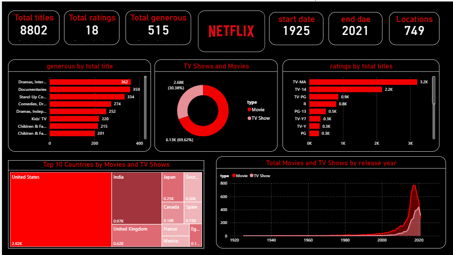

# 📊 Netflix Dashboard (Power BI)

This project is a Power BI dashboard built using Netflix dataset to analyze trends and insights.

---

## 📸 Dashboard Preview

---

## 📂 Files
- netflix_dashboard.pbix → Power BI file
- dashboard.png → Dashboard preview

---

## 🛠️ Tools Used
- Power BI
- Data Visualization

---

## 📌 Description
This dashboard shows insights such as:
- Content distribution
- Genre analysis
- Ratings and trends

---

## ▶️ How to Use
1. Download the .pbix file  
2. Open in Power BI Desktop  
3. Explore the dashboard  

---

## 💼 Use Case
This project demonstrates data analysis and visualization skills using real-world data.